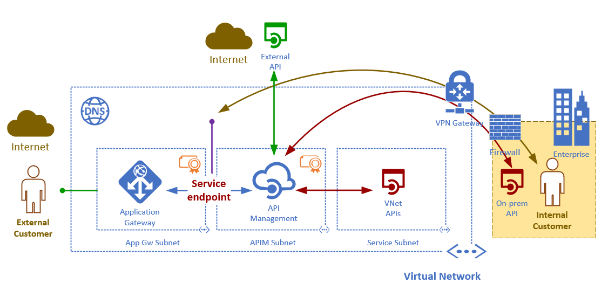
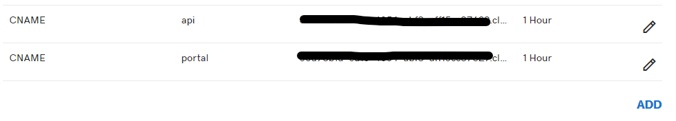

# Azure Application Gateway and API Management

## Main scenario

To inspect incoming traffic into API Management portal and gateway using Application Gateway's WAF capabilities. Under this scenario API management in deployed in internal mode. In this mode, API Management is able to connect to internal and external services. Internal services obtain private IP addresses inside the Vnet and never get exposed to the public internet. Development of internal services can leverage App Service Environment, VMs, and Kubernetes, for example. All layer 7 traffic arriving at the application gateway will be inpected and prevented from executing common attacks.

## Why use Azure API Management

The application gateway pattern is one of the key components in modern microservices architecture. Under this pattern, there's a common entry point into the services that may be exposed as part of microservices architecture. The benefits of this pattern include among other things service discovery, caching, reshaping of the request/response pipelines, consolidated security, monetization, etc. Azure's API Management offers these capabilities and much more.

## Why use Azure Application Gateway?

Azure Application Gateway provides centralized protection of your web applications from common exploits and vulnerabilities.

## Scenario Diagram



## Infrastructure aspects

- Application Gateway and API Management are deployed inside subnets on a Vnet
  - Each services requires its own subnet
- DNS is highly recommended in order for API Magement to resolve internal service names
  - You can deploy an Azure Private Zone or your own
- Certificates are required to encrypt the data between Application Gateway and API Management
- Certificates are required to set the custom gateway and portal hostnames in API Management


## Steps to deploy this scenario

### 1. Create the self-signed certifcates (Optional)
> File: **CreateSelfSignedCertificates.ps1**

- Certifices are used to set the portal and gateway hostnames in API management
- They are also used to configure communication between Application Gateway and API Management
- API Management support self-signed certificates

#### What will the script do?

- The script will create a self-signed root CA
- It will also create the api and gateway certificate signed by the root CA

### 2. Deploy API Management and Application Gateway

> File: **DeployServices.ps1**

Remeber to change the parameters before executing this script

```powershell
# Create resource group
$resGroupName = "apim-appGw-RG" # resource group name
$location = "East US"           # Azure region
New-AzResourceGroup -Name $resGroupName -Location $location

# Set the new domains
$domain = "yourdomain.com"
$gatewayHostname = "api.$domain"                 # API gateway host
$portalHostname = "portal.$domain"               # API developer portal host
$gatewayCertCerPath = "D:\certs\ecademo1.com\api.ecademo1.com.cer" # full path to api.contoso.net .cer file
$gatewayCertPfxPath = "D:\certs\ecademo1.com\api.ecademo1.com.pfx" # full path to api.contoso.net .pfx file
$portalCertPfxPath = "D:\certs\ecademo1.com\portal.ecademo1.com.pfx"   # full path to portal.contoso.net .pfx file
$gatewayCertPfxPassword = "YourSecurePassowrd"   # password for api.contoso.net pfx certificate
$portalCertPfxPassword = "YourSecurePassowrd"    # password for portal.contoso.net pfx certificate
```

#### 2.1 Steps
#### 2.1.1 Create the Vnet and subnet
- AppGw deployed to subnet
- API Management deployed to subnet
#### Create the API Management in the APIM subnet
#### Create a public IP
#### Create the Application Gateway

##### Application Gateway Configuration Diagram


#### CNAME Configuration

- Get the public IP's fully qualified domain
- Configure your external DNS and add the CNAME


### 3. Deploy an Azure Private DNS Zone (Optional)

> Note: Powershell - DeployPrivaZone.ps1

- It is best practice to references private service by a DNS name in API Management. 
- You may also deploy your own DNS service.

## Reference Documents

- https://docs.microsoft.com/en-us/azure/api-management/api-management-howto-integrate-internal-vnet-appgateway
